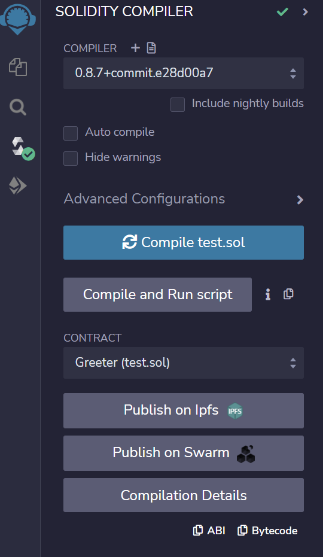

# 运行配置

## 版本

```
node==18.2.1
```

## 运行命令

在一个terminal中：

```bash
cd blockchain
npm install
npx hardhat compile
npx hardhat node
```

在另一个terminal中：

```bash
cd blockchain
npx hardhat run --network localhost scripts/sample-script.js
```

在另一个terminal中：

```bash
cd frontend
npm install
npm run dev
```

启动网页```http://localhost:3000/```即可。需要浏览器预装metamask插件，否则将无法正确运行。

# 开发配置

## 环境配置

vscode extension: Solidity

Node.js

### 合约部署

在一个terminal中：

```bash
cd blockchain
npm install
npx hardhat compile
npx hardhat node
```

在另一个terminal中：

```bash
cd blockchain
npx hardhat run --network localhost scripts/sample-script.js
```

合约将部署在HardHat的测试网中

### 前端

```bash
cd frontend
npm install
npm run dev
```

## 示例

contracts, scripts, 和test文件夹内为示例合约、示例部署脚本和示例测试脚本

## 前后端连接方法

运行```npx harhat node```之后会出来一堆账号和私钥，随便拿一个私钥，打开metamask，网络切换到localhost开头的本地网络，点头像->导入账户，把刚才的私钥输进去，就能拿到测试代币

在/frontend/src/utils/contract.js中 将第三行const address 修改为刚刚运行```npx hardhat run --network localhost scripts/sample-script.js```得到的地址复制过来

将当前合约的ABIjson存在/frontend/src/utils/ABI.json中

> ABIjson的获取方法：将合约复制到https://remix.ethereum.org/中，删除import语句和console.log语句，编译，在下图右下角处复制ABI
>
> 

希望调用contract的某个方法时的示例：

```javascript
this.contract.methods.greet().call({from:this.account})
	.then(function(results) {
    	console.log(results); // 或者其他需要用result做的操作
    });
```

除了.call，其他方法 参考https://web3js.readthedocs.io/en/v1.2.11/web3-eth-contract.html#id26 中methods相关的函数

## 参考文档

Vue***3***: https://vuejs.org/guide/introduction.html

Vuetify3 (替代element-ui): https://next.vuetifyjs.com/en/getting-started/installation/

HardHat: https://hardhat.org/hardhat-runner/docs/getting-started#overview